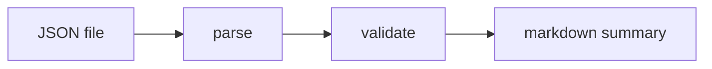

# HLD - Node.js 报告摘要 CLI

## 架构

CLI 使用 Node.js 标准库 `fs` 和 `process`。核心流程为读取 JSON、校验字段、生成 Markdown。

```mermaid
flowchart LR
    A["JSON file"] --> B["parse"]
    B --> C["validate"]
    C --> D["markdown summary"]
```

